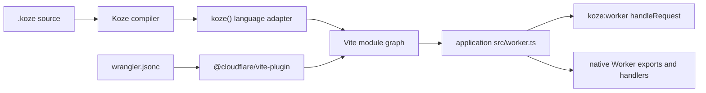

# Koze architecture

## Product boundary

Koze is the HTML-first full-stack framework where the application is a native Cloudflare Worker from the first dev request to production.

Koze owns:

- the `.koze` language
- route, layout, app-shell, and component compilation
- the fixed `src/routes/api/` to `/api` application-route convention
- SSR, hydration, streaming, and progressive enhancement
- forms, actions, navigation, cookies, and request middleware
- browser-to-Worker `$server/*` RPC
- the HTTP `handleRequest` function composed into the application Worker

The application and Cloudflare own:

- `src/worker.ts` and its complete default and named exports
- Wrangler configuration and generated binding types
- Durable Objects, Workflows, Queues, Pipelines, Containers, Sandbox, Agents, and every other platform primitive
- static asset configuration, resource lifecycle, preview, and deployment
- product-specific identity, authorization, retry, storage, and infrastructure decisions

## Module graph



The Vite plugins are peers. Koze never invokes, configures, or wraps the Cloudflare plugin.

The API route root and URL prefix are deliberately not Vite options. `src/routes/api/` maps to `/api`; applications needing non-standard HTTP routing compose it explicitly in `src/worker.ts`.

## Source layers

| Path | Responsibility |
|---|---|
| `src/compiler/` | Deterministic Koze language parsing, analysis, transforms, diagnostics, source maps, and type generation |
| `src/runtime/` | Request-time framework helpers for HTTP, rendering, RPC, actions, middleware, cookies, security, and streaming |
| `src/vite/` | Thin Vite orchestration: virtual modules, graph wiring, cache invalidation, HMR, and the Koze HTTP handler |
| `src/create/` | One-time application scaffold with explicit Worker and Cloudflare configuration |

Compiler logic must live under `src/compiler/`. Vite hooks consume compiler APIs and retain only graph/build-environment state.

## Worker ownership

`koze:worker` exports a named `handleRequest` function:

```ts
import { handleRequest } from 'koze:worker';

export { NativeObject } from './server/native-object';

export default {
  fetch: handleRequest,
  queue: consumeQueue,
  scheduled: runSchedule,
} satisfies ExportedHandler<Env>;
```

Koze does not generate this module, add named exports, synthesize non-fetch handlers, or mutate it during dev. The scaffolder creates it once and the application owns it thereafter.

## Server modules

`src/server/` contains ordinary TypeScript/JavaScript modules. Every exported value is eligible for `$server/*` RPC; no filename suffix has product semantics.

The browser path compiles an import into a Cap'n Web client stub. The Worker path resolves the real server module. Both paths share types generated into `src/app.d.ts`.

Durable Object identity and authorization remain visible in an ordinary server function:

```ts
export async function updateOrganization(id: string, input: Input) {
  await requireOrganizationAccess(id);
  return env.ORGANIZATIONS.getByName(id).update(input);
}
```

This explicit boundary preserves the valuable cohesive browser RPC experience without pretending DO identity selection is generic framework work.

## Virtual modules

Public modules are limited to framework concepts:

- `koze:worker`
- `koze:request`
- `koze:navigation`
- `koze:cookies`
- `koze:middleware`
- `koze:component`
- `koze:content`
- `koze:environment`

Internal route, app, manifest, dispatcher, RPC-map, security, and client-fragment virtual modules are implementation details.

## Security boundary

Koze owns protections required by its HTTP and RPC model:

- same-origin RPC and action validation
- public/private `$server` export visibility
- safe error serialization
- CSP nonce stamping and configured response security headers
- schema validation used by Koze actions and RPC

Authentication and authorization are application or auth-package responsibilities. Cloudflare Access integration is not part of Koze core.

## Verification boundary

The fast suite runs compiler, Vite, and runtime helpers in Node. A separate Cloudflare Vitest project runs the real application Worker in `workerd` and verifies:

- Koze SSR through `handleRequest`
- a native named Durable Object export and binding
- native DO RPC
- coexistence of an application-owned Queue handler

Build, check, Node tests, and workerd tests are all part of `bun run test`/the required verification workflow.

## Prohibited regressions

Koze core must not regain:

- Wrangler parsing or writes
- Cloudflare product filename conventions
- generated platform class exports or handler switches
- Durable Object facade/proxy synthesis
- product registries or provisioning artifacts
- APIs whose primary noun is a Cloudflare product

Adding a Cloudflare product to an application must never require a Koze release.
