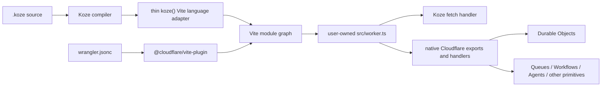

# RFC: Cloudflare-native Koze core

## Status

Implemented in the 2026-08-24 breaking migration. The package now has an
application-owned Worker entrypoint, a platform-free compiler boundary, no
Cloudflare product conventions or Wrangler mutation, and workerd integration
coverage for SSR, native Durable Object RPC, and a non-fetch handler.

## Product statement

> Koze is the HTML-first full-stack framework where the application is a native Cloudflare Worker from the first dev request to production.

This statement is the boundary for the refactor. Koze owns the HTML-first application language and HTTP application model. Cloudflare owns Cloudflare products, Worker configuration, local platform behavior, and deployment.

## Decision

Koze will stop discovering, configuring, provisioning, wrapping, or generating interfaces for individual Cloudflare products.

Koze will remove all server-unit filename conventions:

- `.agent.ts`
- `.workflow.ts`
- `.queue.ts`
- `.pipeline.ts`
- `.container.ts`
- `.sandbox.ts`
- `.do.ts`

These files become ordinary TypeScript modules. The application explicitly exports Worker classes and event handlers from `src/worker.ts`, and explicitly configures bindings and resources through Wrangler or the supported programmatic configuration surface of `@cloudflare/vite-plugin`.

This is a breaking simplification. It will ship as one coherent release without permanent compatibility aliases, hidden fallback discovery, or a second legacy build path.

## Why

The existing platform layer mirrors fast-moving Cloudflare schemas and generates substantial hidden machinery:

- Koze parses and rewrites `wrangler.jsonc`.
- Koze derives resource names and binding names from filenames.
- Koze synthesizes Durable Object facade classes and browser/server proxy modules.
- Koze generates Queue dispatch, Workflow registries, Pipeline registries and provisioning artifacts.
- Koze generates Cloudflare API Shield OpenAPI and Terraform artifacts.
- Koze encodes product-specific defaults for Containers and Sandbox.

This creates two costs:

1. Cloudflare changes become Koze framework bugs even when the Koze language is unaffected.
2. Developers cannot see the actual Worker architecture because bindings, identities, exports, and execution boundaries are inferred or generated.

The native Cloudflare APIs are now concise enough that most wrappers save little code. The framework should make the application model simple without hiding the platform model.

## Product boundary

### Koze owns

- `.koze` parsing, diagnostics, and source maps
- HTML-first templates and components
- File-based pages, layouts, and the document shell
- SSR, hydration, reactivity, and streaming HTML
- Native form actions and POST-Redirect-GET
- Progressive enhancement
- Browser-to-Worker `$server/*` RPC
- `AsyncValue` and generic async rendering boundaries
- Request context, cookies, navigation, middleware, and HTTP security primitives
- Generic schema validation
- Vite integration needed to teach Vite the Koze language
- The Koze fetch handler used by the application Worker

### Cloudflare and the application own

- `wrangler.jsonc` parsing and validation
- Bindings and generated binding types
- Durable Objects and their identities
- Durable Object class declarations through `exports`
- Workflows
- Queues
- Pipelines
- Containers
- Sandbox
- Agents
- Scheduled, Queue, Email, Tail, Alarm, and other Worker handlers
- API Shield provisioning
- Cloudflare Access product integration
- Resource creation, deployment, preview, and local simulation
- The complete `src/worker.ts` entrypoint

### Selection rule for future features

A feature belongs in Koze core only if it does at least one of the following:

1. Defines the `.koze` language.
2. Changes Koze's HTTP, rendering, form, navigation, or browser-RPC lifecycle.
3. Provides a generic application primitive that is not coupled to one Cloudflare product schema.
4. Removes substantial application boilerplate without hiding a security, identity, storage, or deployment decision.

A feature does not belong in Koze core if it mirrors Wrangler fields, provisions a Cloudflare product, or makes a platform resource exist because of a filename.

## Target architecture



The two Vite plugins are peers:

```ts
// vite.config.ts
import { cloudflare } from '@cloudflare/vite-plugin';
import { koze } from '@kuratchi/koze/vite';
import { defineConfig } from 'vite';

export default defineConfig({
  plugins: [
    koze(),
    cloudflare({ viteEnvironment: { name: 'ssr' } }),
  ],
});
```

`koze()` does not call, wrap, configure, or replace `cloudflare()`.

## Target Worker entrypoint

The application owns the default Worker export. Koze exposes a request handler rather than owning the entire default export.

```ts
// src/worker.ts
import { handleRequest } from 'koze:worker';
import { handleNotifications } from './server/notifications';

export { OrgAuth } from './server/org-auth';
export { RequestApprovalWorkflow } from './server/request-approval-workflow';
export { SessionAgent } from './server/session-agent';

export default {
  fetch: handleRequest,

  queue(batch, env, ctx) {
    return handleNotifications(batch, env, ctx);
  },

  scheduled(controller, env, ctx) {
    ctx.waitUntil(runScheduledWork(controller, env));
  },
} satisfies ExportedHandler<Env>;
```

`koze:worker` may remain a virtual module because it depends on the compiled route graph, but its public responsibility is limited to the Koze HTTP handler. It must not discover or re-export platform classes, generate platform handlers, or initialize product registries.

## Target compiler boundary

The compiler accepts source and returns deterministic code, metadata, diagnostics, and dependencies. It does not mutate the project or know about Wrangler.

Suggested public shape:

```ts
interface KozeCompiler {
  analyzeProject(options: ProjectOptions): ProjectAnalysis;
  compileRoute(input: RouteCompileInput): CompileResult;
  compileComponent(input: ComponentCompileInput): CompileResult;
  compileServerModule(input: ServerModuleCompileInput): CompileResult;
  emitVirtualModule(id: KozeVirtualModuleId, analysis: ProjectAnalysis): CompileResult;
  generateTypes(analysis: ProjectAnalysis): string;
}

interface CompileResult {
  code: string;
  map?: string;
  dependencies: string[];
  diagnostics: KozeDiagnostic[];
}
```

The compiler must not expose a `cloudflare` capability group. Product discovery, Wrangler synchronization, API Shield output, Pipeline artifacts, and Durable Object synthesis are removed rather than moved elsewhere inside the compiler.

Application API routing remains a Koze compiler concern with one convention: TypeScript and JavaScript files below `src/routes/api/` map below `/api`. The source root and URL prefix are not Vite options. Applications compose non-standard HTTP routing explicitly in `src/worker.ts`.

## Target Vite adapter boundary

The Koze Vite adapter should only:

- create and cache the compiler/project analysis
- call compiler transforms from Vite hooks
- resolve and load `koze:*` virtual modules
- register route, layout, component, and server-module dependencies
- invalidate precisely on HMR
- expose the compiled Koze fetch handler through `koze:worker`
- write developer-facing generated types when their content changes

It should not:

- parse or write Wrangler configuration
- infer Cloudflare resources
- synthesize Cloudflare class exports
- synthesize non-fetch Worker handlers
- provision files under `_cloudflare/`
- encode product-specific binding shapes or defaults
- run its own client/SSR build process when Vite environments provide the needed graph separation

## Removal and extraction inventory

### Delete from compiler core

- `src/compiler/convention-discovery.ts`
- `src/compiler/durable-object-pipeline.ts`
- `src/compiler/pipeline-artifacts.ts`
- `src/compiler/wrangler-sync.ts`
- `src/compiler/api-shield.ts`
- Cloudflare product entry types in `src/compiler/compiler-shared.ts`
- the `cloudflare` capability from `src/compiler/service.ts`
- corresponding exports from `src/compiler/index.ts`

Before deleting `convention-discovery.ts`, move only genuinely generic filesystem traversal utilities to a narrowly named project-analysis module. Do not retain suffix validation or product class inspection.

### Remove from the Vite integration

- `syncWranglerFromConventions()`
- `ensureWorkerEntry()` as a dev-time mutation; scaffolding creates the file once
- convention-class discovery and re-export assembly
- generated Queue switch dispatch
- generated Workflow registry initialization
- generated Pipeline registry initialization
- generated Durable Object facade classes
- generated Durable Object proxy paths
- API Shield metadata collection and artifact writes
- `src/assets` to Wrangler asset synchronization
- HMR branches dedicated to removed product suffixes
- `KozeViteOptions.apiShield`
- any Koze option that mirrors Cloudflare platform configuration

Retain route/component/server-module HMR and Koze HTTP security options that apply to framework-generated responses.

### Delete from runtime core

- `src/runtime/do.ts`
- `src/runtime/pipeline.ts`
- `src/runtime/workflow.ts`
- `src/runtime/containers.ts`
- `koze:workflow`
- `koze:pipeline`
- DO resolver/context globals and generated-stub helpers
- product registries
- Workflow-specific polling registration

### Extract or replace generic behavior

- Replace Workflow-specific polling with a generic Koze response-refresh primitive, if the behavior remains desirable.
- Keep generic `AsyncValue`; it is part of Koze's async rendering model.
- Keep generic schema validation; callers can use it inside ordinary `$server` functions or native Worker RPC methods.
- Keep generic security headers, CSP nonce support, origin integrity, and RPC visibility rules; they secure Koze HTTP/RPC behavior rather than provisioning Cloudflare products.
- Move Cloudflare Access helpers out of core. If Kyzen needs them, expose them from a Kyzen Cloudflare integration; otherwise application middleware reads the Access identity intentionally.
- Move container routing/proxy helpers to the consuming application or a dedicated package. They are application/container integration logic, not framework runtime.
- Do not extract Pipeline or API Shield generators into another Koze core package. Retire them. Existing generated infrastructure files become application-owned.

### Package export cleanup

Remove exports for:

- `./runtime/do.js`
- `./runtime/pipeline.js`
- `./pipeline`
- Workflow-specific runtime exports
- container helpers
- Cloudflare Access helpers if extracted
- top-level `kozeDO`, `doRpc`, `getDb`, `RpcOf`, `pipeline`, `pipelines`, `sendPipeline`, and `workflowStatus`

Audit `src/index.ts`, `src/runtime/index.ts`, `package.json`, and generated declarations together. No removed API should remain as a no-op compatibility shim.

## Application migration recipes

### Durable Objects

Before:

```ts
// src/server/org-auth.do.ts
export class OrgAuth extends DurableObject<Env> {
  static binding = 'ORG_DB';

  async updateUser(input: UpdateUserInput) {
    return this.writeUser(input);
  }

  private writeUser(input: UpdateUserInput) {
    // ...
  }
}
```

```ts
// route
import { updateUser } from '$server/org-auth.do';
```

After:

```ts
// src/server/org-auth.ts
import { DurableObject } from 'cloudflare:workers';

export class OrgAuth extends DurableObject<Env> {
  async updateUser(input: UpdateUserInput) {
    return this.#writeUser(input);
  }

  #writeUser(input: UpdateUserInput) {
    // ...
  }
}
```

```ts
// src/server/users.ts
import { env } from 'cloudflare:workers';
import { requireAuth } from './auth';

export async function updateUser(input: UpdateUserInput) {
  const user = await requireAuth();
  return env.ORG_DB.getByName(user.organizationId).updateUser(input);
}
```

```ts
// route
import { updateUser } from '$server/users';
```

```ts
// src/worker.ts
import { handleRequest } from 'koze:worker';
export { OrgAuth } from './server/org-auth';
export default { fetch: handleRequest } satisfies ExportedHandler<Env>;
```

```jsonc
// wrangler.jsonc
{
  "durable_objects": {
    "bindings": [
      { "name": "ORG_DB", "class_name": "OrgAuth" }
    ]
  },
  "exports": {
    "OrgAuth": {
      "type": "durable-object",
      "storage": "sqlite"
    }
  }
}
```

Migration rules:

- Rename `.do.ts` to an ordinary `.ts` filename.
- Export the actual Durable Object class from `src/worker.ts`.
- Replace TypeScript-only `private`/`protected` RPC-sensitive methods with JavaScript `#private` methods or move helpers outside the class.
- Replace direct `$server/*.do` browser imports with explicit ordinary `$server` functions that select the DO identity and perform authorization.
- Delete `static binding`, `__registerDoResolver`, `kozeDO`, `doRpc`, and generated-proxy assumptions.
- Prefer Cloudflare's declarative `exports` configuration for new or migrated classes. Existing applications must follow Cloudflare's documented migration path before replacing a legacy migration history.

### Workflows

- Rename `.workflow.ts` to an ordinary `.ts` module.
- Export the Workflow class explicitly from `src/worker.ts`.
- Declare `workflows[]` explicitly in Wrangler.
- Replace `workflowStatus('name', id)` with the native binding:

```ts
const instance = await env.REQUEST_APPROVAL_WORKFLOW.get(id);
const status = await instance.status();
```

- If generic route refresh is retained, register it independently of Workflow:

```ts
refreshRouteWhile({ every: '2s', until: isTerminal(status) });
```

### Queues

- Rename `.queue.ts` to an ordinary handler module.
- Define producers and consumers explicitly in Wrangler.
- Add the Worker `queue()` handler explicitly in `src/worker.ts`.
- If one Worker consumes several queues, dispatch on `batch.queue` in visible application code.
- Preserve all consumer options such as retries, dead-letter queue, timeout, batch size, and concurrency in Wrangler rather than deriving defaults in Koze.

### Pipelines

- Delete `.pipeline.ts` declarations.
- Declare the stream binding explicitly in Wrangler using Cloudflare's current schema.
- Call `env.<BINDING>.send(records)` directly.
- Move generated schema and SQL files to an application-owned infrastructure directory.
- Replace generated setup scripts with documented Wrangler commands, Terraform, Pulumi, or another intentional infrastructure workflow.
- Delete generated `_cloudflare/pipelines/` README/setup files once their useful content has been migrated.

### Containers

- Rename `.container.ts` to an ordinary module.
- Export the class explicitly from `src/worker.ts`.
- Move image, instance type, instance cap, binding, and storage declaration to current Wrangler configuration.
- Move container HTTP proxy/routing helpers into the application that owns those URL semantics.

### Sandbox

- Rename `.sandbox.ts` to an ordinary module.
- Follow the installed Sandbox SDK's current setup instructions.
- Export the class explicitly and configure its image, binding, and storage intentionally.
- Do not infer an image from the SDK version inside Koze core.

### Agents

- Rename `.agent.ts` to an ordinary module.
- Export top-level Agent classes explicitly from `src/worker.ts`.
- Configure bindings and declarative class exports explicitly.
- Allow the Agents SDK and Cloudflare configuration to define child/facet behavior without Koze discovery.

### API Shield

- Remove `koze({ apiShield: ... })`.
- Preserve any generated OpenAPI/Terraform artifacts that are currently deployed by moving them to an application-owned infrastructure directory.
- Choose an intentional source of truth for OpenAPI and API Shield operations.
- Use Cloudflare tooling or infrastructure-as-code directly.
- Delete route-adjacent `.api-shield.ts` files after their declarations have been migrated.

### Static assets

- Stop writing `assets.directory` and `assets.binding` from Koze.
- Prefer Vite's standard `public/` directory for new applications unless Koze has a language-level reason to retain a different directory.
- Configure Cloudflare Workers Assets explicitly through Wrangler or the Cloudflare Vite plugin.
- Preserve Koze's compiled client asset manifest behavior; remove only platform configuration mutation.

## Scaffolder changes

New projects must visibly install and configure both peer plugins.

The scaffolder creates:

- `vite.config.ts` with separate `koze()` and `cloudflare()` entries
- a user-owned `src/worker.ts` whose default export includes `fetch: handleRequest`
- a minimal valid `wrangler.jsonc` containing only application-owned Cloudflare configuration
- `public/` for static public files
- a workerd-backed integration test using Cloudflare's current Vitest integration or test harness

The default template must not include a sample `.do.ts` or any server-unit suffix. If the template demonstrates a Durable Object, it uses a normal class, explicit Worker export, explicit binding, and declarative class export.

## Implementation phases

### Phase 0: establish native-Worker verification before deleting behavior

Add a real integration fixture that proves the target composition against workerd:

- Koze page renders through `handleRequest`.
- `$server/*` RPC works from the Worker bundle.
- A native Durable Object class is exported from `src/worker.ts`.
- A Koze route calls its local binding.
- A Queue handler can coexist with Koze fetch handling.
- A Scheduled handler can coexist with Koze fetch handling.
- Vite dev and production build resolve the same Worker module graph.

Use Cloudflare's current supported Vitest integration or Wrangler test harness. Do not recreate a generated-Worker emulator.

Exit criterion: the new fixture fails if `src/worker.ts` exports or non-fetch handlers are dropped, and passes without any Koze product convention.

### Phase 1: make the Worker entrypoint application-owned

1. Change `koze:worker` to export `handleRequest`.
2. Update the scaffolder and fixtures to use an explicit Worker default export.
3. Stop creating or mutating `src/worker.ts` during Vite startup.
4. Ensure Cloudflare sees all user-authored named exports and event handlers unchanged.
5. Validate dev/build/preview parity.

Exit criterion: an application can add any supported Worker export or handler without modifying Koze or generated output.

### Phase 2: extract deterministic compilation from `src/vite/`

1. Move route/component/server transforms that still live in `src/vite/index.ts` behind compiler APIs.
2. Move virtual-module source generation behind compiler APIs where the output is deterministic.
3. Keep Vite environment selection, cache state, watchers, and HMR in the adapter.
4. Reduce the adapter to orchestration around Vite hooks.
5. Add compiler tests for every extracted primitive before deleting the old path.

Exit criterion: `src/vite/` contains no template parsing, AST transformation, route code generation, product discovery, or platform configuration mutation.

### Phase 3: remove Wrangler and infrastructure generation

1. Delete Wrangler sync and its config types.
2. Delete Pipeline artifact generation.
3. Delete API Shield generation.
4. Delete assets-to-Wrangler synchronization.
5. Remove the compiler `cloudflare` capability.
6. Remove all file writes under `_cloudflare/`.

Exit criterion: searching Koze source for Wrangler config field names finds only documentation explaining that the application owns them.

### Phase 4: remove server-unit conventions

1. Delete suffix discovery and plural-suffix errors.
2. Delete class export inference.
3. Delete Queue dispatch synthesis.
4. Delete Workflow/Pipeline registries and typed filename unions.
5. Stop excluding convention-shaped filenames from normal `$server` type generation.
6. Treat every ordinary module under `src/server/` consistently.

Exit criterion: renaming an ordinary server module cannot change Cloudflare infrastructure or Worker exports.

### Phase 5: remove Durable Object synthesis and proxies

1. Delete generated Durable Object facade classes.
2. Delete generated DO handler proxies.
3. Delete request-context method splitting.
4. Delete DO resolver registration and implicit stub selection.
5. Delete DO-specific schema registry handling.
6. Migrate dogfood applications to native DO classes and explicit `$server` boundary functions.
7. Add a diagnostic or documentation warning that TypeScript `private` is not runtime RPC privacy; use JavaScript `#private`.

Exit criterion: Koze neither parses nor transforms Durable Object classes, and the native class executes successfully in workerd development and production build tests.

### Phase 6: remove or extract product runtimes

1. Delete Pipeline and Workflow runtime modules and virtual modules.
2. Replace Workflow polling with a generic route-refresh primitive or remove it.
3. Remove container routing helpers from core.
4. Move Cloudflare Access integration to its owning auth package or application middleware.
5. Remove stale package exports and types.

Exit criterion: Koze runtime code contains no API whose primary noun is a Cloudflare product.

### Phase 7: migrate scaffolds, dogfood apps, and documentation

1. Migrate the primary validation app first.
2. Migrate the library dogfood package if it consumes removed APIs.
3. Migrate PIMS and other active Koze applications.
4. Rewrite README and architecture docs around the product statement.
5. Replace all convention examples with native Worker examples.
6. Update the architectural decision log rather than silently rewriting history.
7. Publish a focused breaking-change migration guide.

Exit criterion: no active application depends on removed suffixes, generated Wrangler edits, generated platform classes, or product runtime helpers.

### Phase 8: release proof

1. Run package build, check, and complete tests.
2. Run workerd integration tests against dev-equivalent and built output.
3. Run the PIMS application typecheck and build.
4. Run a local PIMS smoke test that invokes a native DO.
5. Perform a Wrangler deployment dry run.
6. Perform one real Cloudflare smoke deployment to a non-production Worker.
7. Verify route rendering, browser RPC, DO RPC, static assets, and at least one non-fetch handler.

Exit criterion: the product statement is demonstrated, not merely documented.

## Test plan

### Compiler tests

- `.koze` parse and validation
- route, layout, component, and server-module compilation
- browser/server import separation
- actions and forms
- hydration and streaming
- source maps and diagnostics
- virtual modules that belong to the Koze language
- generated app types without platform filename unions

### Vite tests

- plugin composition with `@cloudflare/vite-plugin`
- route and component HMR
- server-module HMR
- client and SSR environment parity
- `koze:worker` handler export
- user Worker exports remain visible
- no Wrangler writes during config, dev, build, or HMR

### Workerd integration tests

- SSR request
- static asset request
- native form submission and redirect
- enhanced action
- browser `$server` RPC transport
- native Durable Object binding and RPC
- Queue event
- Scheduled event
- middleware and cookies
- errors and streaming responses

### Regression assertions

- Vite startup performs no recursive product-convention scan.
- Koze never parses `wrangler.jsonc`.
- Koze never writes `wrangler.jsonc`.
- Adding a Cloudflare product does not require a Koze release.
- Updating Wrangler does not require updating a mirrored Koze schema.

## Compatibility and release strategy

This refactor should not maintain a hidden compatibility mode. A compatibility mode would preserve the exact complexity being removed and would create two Worker construction paths.

Provide instead:

- a single breaking release
- an explicit migration guide
- a read-only audit command or one-off codemod that reports convention files and required manual actions
- optional mechanical renames where they are unambiguous
- no automatic infrastructure rewrite without user review

The migration tool may identify:

- convention files
- generated Worker exports that need to become explicit
- `$server/*.do` imports needing boundary functions
- uses of removed runtime APIs
- Koze-managed Wrangler blocks
- `_cloudflare/` artifacts that need ownership decisions

It must not guess Durable Object identity, authorization rules, Queue retry policy, Pipeline provisioning, or infrastructure lifecycle.

## Documentation rewrite

The README opening should lead with:

> Koze is the HTML-first full-stack framework where the application is a native Cloudflare Worker from the first dev request to production.

The first architecture example should show:

1. a `.koze` page
2. a `$server` function
3. an HTML form
4. a user-owned Worker entrypoint
5. the official Cloudflare Vite plugin
6. an optional native Durable Object export

The documentation must clearly say:

- Koze does not provision Cloudflare resources.
- Koze does not modify Wrangler configuration.
- Koze does not wrap native Cloudflare bindings.
- All Worker exports and event handlers are available because the application owns `src/worker.ts`.
- Development runs through Cloudflare's Vite environment in workerd.
- Platform configuration follows current Cloudflare documentation.

## Definition of done

The migration is complete when all of the following are true:

- Only `.koze` and route/layout/app naming carry Koze compiler semantics.
- `src/server/` contains ordinary modules with no reserved Cloudflare suffixes.
- The application owns `src/worker.ts` and its complete default/named exports.
- `koze:worker` exposes only the Koze HTTP handler and related framework metadata.
- `koze()` and `cloudflare()` are independent peer plugins.
- Koze does not parse or write Wrangler configuration.
- Koze core contains no Cloudflare product provisioning or product-specific registry.
- Durable Objects use native classes, bindings, identities, and RPC.
- Browser-to-Worker `$server` RPC remains cohesive and fully tested.
- Native forms, SSR, hydration, and progressive enhancement remain intact.
- Dev, build, preview, and deployed behavior are verified against workerd/Cloudflare.
- The full package verification workflow passes.
- PIMS and the primary dogfood app run without convention compatibility code.

At that point, Koze has one defensible center: an HTML-first full-stack application model that is natively a Cloudflare Worker rather than adapted into one after the fact.
